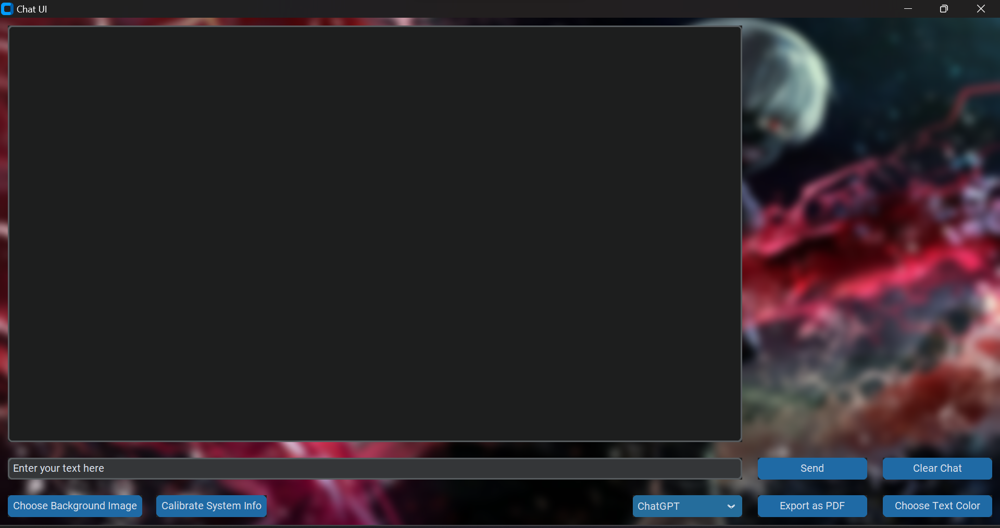
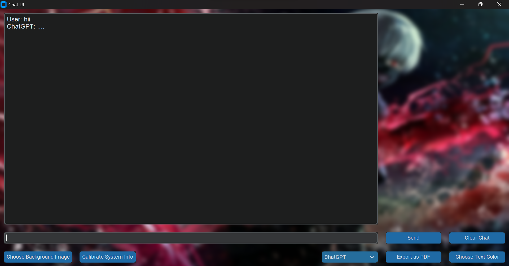
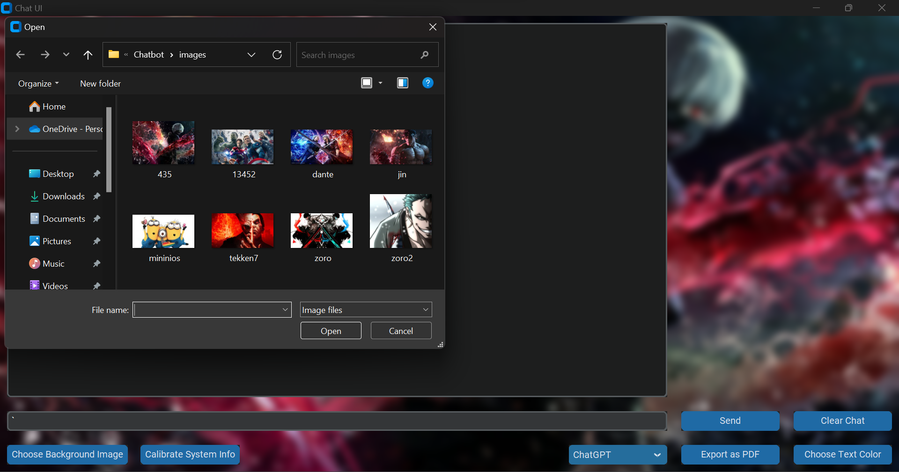

# Real Time System Troubleshooting using AI tools

This project is a real-time system troubleshooting application that utilizes AI tools for providing solutions and assistance in resolving system issues. It provides an interactive chat interface where users can communicate with AI-powered chatbots to diagnose and troubleshoot various system problems.

## Features
- **Multiple Chatbot Integration:** The application integrates multiple AI chatbot frameworks, including ChatGPT, BARD, BingAI, and ChatGPT-4, to provide diverse and efficient responses.
- **Intelligent System Analysis:** The system can analyze the user's system information, such as operating system details, CPU utilization, memory usage, storage level, running processes, available updates, and bug logs, to provide accurate troubleshooting suggestions.
- **Export Chat History:** Users can export the chat history as a PDF file for future reference and documentation purposes.
- **Customization Options:** Users can customize the text color, background image, and select different AI chatbots based on their preferences.

## ScreenShots




## Installation
- Clone the repository:
```bash
git clone https://github.com/BabaYaga1221/Real-time-Troubleshooting-System.git
```
- Install the required dependencies:
```bash
pip install -r requirements.txt
```
- Run the application:
```css
python src.py
```
Note: Make sure you have Python (version 3.0 or higher) installed on your system. And, to work with the AI API, you need to have a valid API key or Token key. You can get the API key from the respective API provider's website. For example, you can get the API key for the BARD API from [here](https://blog.google/technology/ai/bard-google-ai-search-updates/).

## Usage
1. Launch the application.
2. Enter your queries or system issues in the input field.
3. Choose the desired chatbot from the dropdown menu.
4. Click the "Send" button to receive responses from the chatbot.
5. View the chat conversation in the text area.
6. Use the "Clear Chat" button to clear the chat history.
7. Use the "Export as PDF" button to export the chat history as a PDF file.
8. Customize the text color and background image using the respective buttons.

## License
This project is licensed under the [MIT License](LICENSE).

Contributing
Contributions are welcome! Feel free to open an issue or submit a pull request for any enhancements or bug fixes.

## Acknowledgements
- [OpenAI for providing the AI chatbot frameworks.](https://openai.com/)
- [Bard API for BARD integration.](https://blog.google/technology/ai/bard-google-ai-search-updates/)
- [RapidAPI for API access.](https://rapidapi.com/hub)
